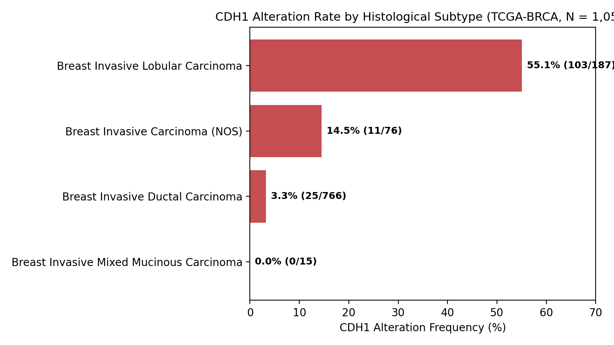
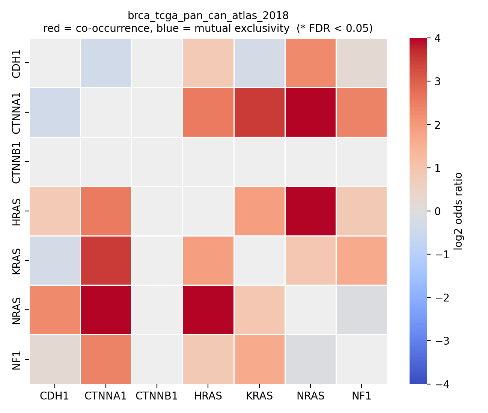
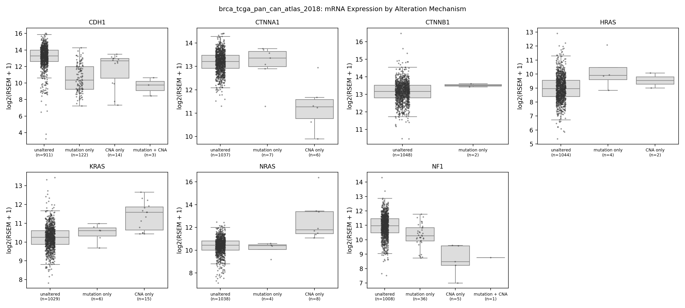

# Adhesion and RAS Pathway Alterations in TCGA Breast Cancer

A Python pipeline that measures how often cell-cell adhesion genes (CDH1, CTNNA1, CTNNB1) and RAS-pathway genes (HRAS, KRAS, NRAS, NF1) are altered in 1,052 TCGA breast tumors, and tests whether the alterations co-occur, change mRNA levels, differ by histology, or relate to overall survival.

**Tools:** Python, pandas, NumPy, SciPy, statsmodels, lifelines, matplotlib, seaborn

## Key findings

- **CDH1 alterations are strongly found in lobular carcinoma:** 55% of lobular tumors (103/187) vs 4% of non-lobular tumors (36/865); odds ratio 28.2. About 74% of all CDH1-altered tumors are lobular.
- **No gene pair (adhesion gene and RAS pathway gene) co-occurred or excluded each other significantly** after FDR correction (15 pairs tested, smallest q = 0.10).
- **No significant association with overall survival** CDH1 alterations were not significantly associated with overall survival in a multivariate Cox model adjusted for age and stage(CDH1 adjusted HR 0.75, 95% CI 0.44 to 1.27, only 18 deaths in the altered group), so only large effects could have been detected.
- **Alterations changed their own gene's mRNA in the expected direction** (CDH1 and NF1 downregulated, KRAS and NRAS upregulated), which serves as a positive control for the pipeline.
- **Part of the CDH1 mRNA drop was due to histology.** The difference was -2.83 log2 units in the whole cohort but -0.89 within lobular tumors only. This confirms that *CDH1* loss directly lowers mRNA levels, while a large portion of the cohort-wide drop reflects baseline differences between ductal and lobular tissue.

## Why I did this

In the lab, I study how cell mechanics and adhesion complexes maintain tissue structure. I built this pipeline to see how genetic disruptions in E-cadherin and RAS signaling actually shape patient tumor data, particularly looking at differences between lobular and ductal breast cancers.


## Data

- **Source:** cBioPortal, *Breast Invasive Carcinoma (TCGA, PanCancer Atlas)*, `brca_tcga_pan_can_atlas_2018`.
- **Files used:** Clinical patient/sample metadata, MAF mutation calls, GISTIC 2.0 copy number, RSEM mRNA counts, and sequenced case lists.
- **Cohort:** 1,052 tumors (one per patient, sequenced, with copy-number data); 1,039 had survival data; 1,021 were used in the adjusted Cox models.


## Methods

- **Alteration Calling:** Non-silent mutation **OR** deep deletion ($\le -2$) for tumor suppressors (*CDH1*, *CTNNA1*, *NF1*) **OR** high amplification ($\ge +2$) for oncogenes (*CTNNB1*, *HRAS*, *KRAS*, *NRAS*).
- **Composite Groups:** `ADHESION` (*CDH1*, *CTNNA1*, *CTNNB1*) and `RAS` (*HRAS*, *KRAS*, *NRAS*, *NF1*).
- **Statistical Tests:**
  - Co-occurrence: Fisher's exact test per gene pair + Benjamini-Hochberg FDR.
  - Survival: Kaplan-Meier curves + multivariate Cox PH regression (adjusted for age and stage).
  - Expression: $\log_2(\text{RSEM} + 1)$ counts, Mann-Whitney U tests, Cliff's delta effect sizes + FDR.
  - Histology: Fisher's exact test (lobular vs. non-lobular) and within-lobular sensitivity testing.

## Results

### 1. Alteration frequencies (n = 1,052)

| Gene / group | Altered | % | Mutated | Copy-number |
|---|---|---|---|---|
| ADHESION (any) | 153 | 14.5 | | |
| CDH1 | 139 | 13.2 | 125 | 17 |
| CTNNA1 | 13 | 1.2 | 7 | 6 |
| CTNNB1 | 2 | 0.2 | 2 | 0 |
| RAS (any) | 78 | 7.4 | | |
| NF1 | 42 | 4.0 | 37 | 6 |
| KRAS | 21 | 2.0 | 6 | 15 |
| NRAS | 12 | 1.1 | 4 | 8 |
| HRAS | 6 | 0.6 | 4 | 2 |

Most alterations in adhesion genes are in CDH1, which is mutated in most cases. KRAS and NRAS alterations are mostly copy-number gains rather than point mutations. NF1 alterations are also mostly point mutations. CTNNB1 and HRAS were too rare to further analyze.

### 2. CDH1 by histology

| Histology | CDH1 altered |
|---|---|
| Lobular (n = 187) | 103 (55.1%) |
| Ductal (n = 766) | 25 (3.3%) |
| All non-lobular (n = 865) | 36 (4.2%) |

Lobular vs non-lobular: odds ratio 28.2, Fisher's exact p < 1e-50. This agrees with the known association between E-cadherin loss and lobular carcinoma. About 45% of lobular tumors had no CDH1 alteration under my definition, so other routes of E-cadherin loss may exist.


### 3. Co-occurrence

I tested 15 gene pairs; none significant after FDR (smallest q = 0.10, CDH1-NRAS and CTNNA1-NRAS). Some odd ratios were large, but they rested on 2 to 5 tumors with both alterations, so I treat them as unconfirmed.


### 4. Survival

| Alteration | Altered (deaths) | Log-rank q | Adjusted HR (95% CI) |
|---|---|---|---|
| CDH1 | 138 (18) | 0.81 | 0.75 (0.44 to 1.27) |
| NF1 | 41 (6) | 0.81 | 0.84 (0.36 to 1.95) |
| ADHESION | 151 (22) | 0.81 | 0.89 (0.55 to 1.44) |
| RAS | 77 (11) | 0.81 | 0.89 (0.47 to 1.67) |

No significant association. The confidence intervals are wide, so moderate effects cannot be excluded. CTNNA1, CTNNB1, HRAS, KRAS and NRAS had too few patients or deaths to test. Because CDH1 alterations are mostly lobular, the CDH1 result partly compares lobular with ductal tumors.

### 5. mRNA expression

Effect of each gene's alteration on its own mRNA (49 comparisons in total, 9 significant at FDR < 0.05):

| Alteration | n altered | Median difference (log2) | Cliff's delta | q |
|---|---|---|---|---|
| CDH1 | 139 | -2.83 | -0.76 | < 0.001 |
| NF1 | 42 | -0.83 | -0.53 | < 0.001 |
| KRAS | 21 | +0.73 | +0.64 | < 0.001 |
| NRAS | 12 | +1.01 | +0.56 | 0.005 |
| CTNNA1 | 13 | -0.32 | -0.36 | 0.12 (not significant) |

- Loss-type changes (CDH1, NF1) decreased the expression of their own mRNA, and mostly-amplified KRAS and NRAS increased it. This served as a **positive control**.
- Of the 5 cross-gene significant results, 3 are circular (the gene is a member of the group tested, e.g. ADHESION and CDH1 mRNA), one duplicates another, and the only independent one (CDH1 alteration and lower NRAS mRNA) disappeared when I restricted to lobular tumors (difference +0.04, p = 0.82).
- **Histology confounding:** within lobular tumors only (103 CDH1-altered vs 84 unaltered), the CDH1 mRNA difference was -0.89 log2 units (p = 0.009), about a third of the whole-cohort effect. The alteration still lowers CDH1 mRNA, but much of the cohort-wide drop reflects lobular vs ductal differences.


### 6. KRAS by molecular subtype (exploratory)

KRAS alteration frequency by PAM50 subtype was 5.3% basal-like, 2.6% HER2-enriched, 1.4% luminal A, 1.0% luminal B and 0% normal-like. [EDIT: add the counts and the Fisher's test result before drawing any conclusion.]

## Key Figures

### 1. CDH1 Alteration Rate by Histology


### 2. Pairwise Co-Occurrence Heatmap


### 3. Target Gene mRNA Expression Changes



## Limitations

- One cohort (TCGA breast cancer) and no external validation.
- Simplified alteration definition; promoter methylation and fusions are not considered.
- Overall survival only, with few deaths in some groups.


## How to run

```bash
git clone https://github.com/<your-username>/tcga-adhesion-ras.git
cd tcga-adhesion-ras
pip install -r requirements.txt
```

1. Download the study from the cBioPortal datasets page and extract it to `data/raw/brca_tcga_pan_can_atlas_2018/`.
2. Run in order:

```bash
python scripts/01_load_and_define_alterations.py
python scripts/02_cooccurrence.py
python scripts/03_survival.py
python scripts/04_expression.py
python scripts/05_histology_and_degs.py
```


## Data and credits

TCGA PanCancer Atlas data via cBioPortal (Cerami et al., 2012; Gao et al., 2013). Python codes developed with AI assistance.

## Author

Mahema CM | MTech Bioengineering | linkedin.com/in/mahemacm | mahema2209@gmail.com
